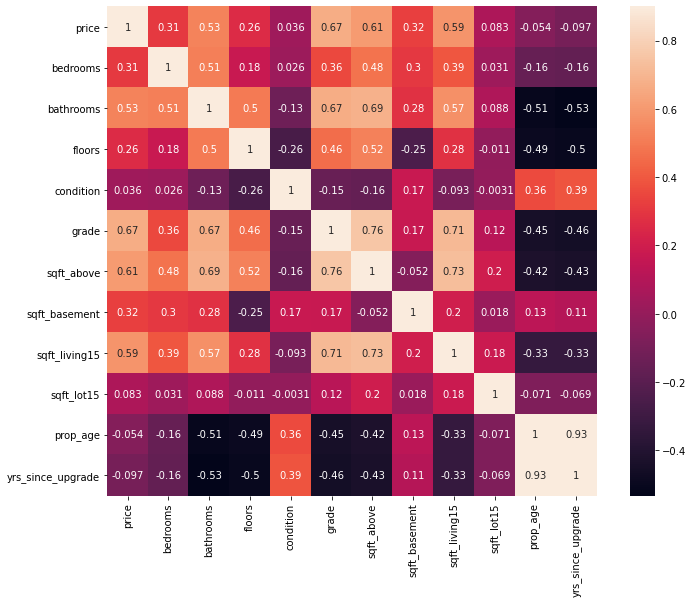

## House Price Regression Model - Kings County

**Author**: David Boyd

## Business Problem
I've been tasked with helping a local real estate company better understand what features in a house have the biggest impact on house price, so they can offer their clients bespoke advice on what impact different improvements made to their house will have on it's overall sale potential value. We want to focus on providing suggestions which the home owners can control and actively improve, so the price of their local neighborhood or whether they live on the waterfront or not will be ignored.

## Data

This project uses the King County House Sales dataset, which can be found in  `kc_house_data.csv` in the data folder in this repository. The description of the column names can be found in `data_dictionary.md` in the same folder.  The dataset includes 21,597 entries, and 21 columns.  Here are the columns in the dataset:

* `id` - Unique identifier for a house
* `date` - Date house was sold
* `price` - Sale price (prediction target)
* `bedrooms` - Number of bedrooms
* `bathrooms` - Number of bathrooms
* `sqft_living` - Square footage of living space in the home
* `sqft_lot` - Square footage of the lot
* `floors` - Number of floors (levels) in house
* `waterfront` - Whether the house is on a waterfront
* `view` - Quality of view from house
* `condition` - How good the overall condition of the house is. Related to maintenance of house.
* `grade` - Overall grade of the house. Related to the construction and design of the house.
* `sqft_above` - Square footage of house apart from basement
* `sqft_basement` - Square footage of the basement
* `yr_built` - Year when house was built
* `yr_renovated` - Year when house was renovated
* `zipcode` - ZIP Code used by the United States Postal Service
* `lat` - Latitude coordinate
* `long` - Longitude coordinate
* `sqft_living15` - The square footage of interior housing living space for the nearest 15 neighbors
* `sqft_lot15` - The square footage of the land lots of the nearest 15 neighbors

Using the above data points, a few additional features have been created, such as:
* `prop_age` - The age of the property when it was sold
* `yrs_since_upgrade` - Year difference between year of renovation and sold year
* `sqft_basement` - Sq footage of the basement, calculated by taking the sqft_above from sqft_living
* `had_upgrade` - If the yr_renovated field is 0 then this is False, otherwise True

## Method
In order to achieve the end objective, this project works on a multivariate regression model, to understand what impact on price each of the chosen features has. Our target variable is `price` and the way we want to perform this is first create a baseline model, by identifying the most correlated features with price. After doing all the necessary pre-processing steps (handling null values, dropping unnecessary columns and one-hot encoding categorical data) we look to improve our R^2 score by iterating on the model through adding in more relevant features into future iterations of the model. Through this process we look to remove any features which have a p-value > 0.05

## Results
Below you can see a heatmap of all the remaining features correlated with price

    

### Baseline Model

<table class="simpletable">
<caption>OLS Regression Results</caption>
<tr>
  <th>Dep. Variable:</th>          <td>price</td>      <th>  R-squared:         </th> <td>   0.265</td>
</tr>
<tr>
  <th>Model:</th>                   <td>OLS</td>       <th>  Adj. R-squared:    </th> <td>   0.265</td>
</tr>
<tr>
  <th>Method:</th>             <td>Least Squares</td>  <th>  F-statistic:       </th> <td>   5848.</td>
</tr>
<tr>
  <th>Date:</th>             <td>Wed, 09 Nov 2022</td> <th>  Prob (F-statistic):</th>  <td>  0.00</td> 
</tr>
<tr>
  <th>Time:</th>                 <td>22:14:52</td>     <th>  Log-Likelihood:    </th> <td> -352.54</td>
</tr>
<tr>
  <th>No. Observations:</th>      <td> 16236</td>      <th>  AIC:               </th> <td>   709.1</td>
</tr>
<tr>
  <th>Df Residuals:</th>          <td> 16234</td>      <th>  BIC:               </th> <td>   724.5</td>
</tr>
<tr>
  <th>Df Model:</th>              <td>     1</td>      <th>                     </th>     <td> </td>   
</tr>
<tr>
  <th>Covariance Type:</th>      <td>nonrobust</td>    <th>                     </th>     <td> </td>   
</tr>
</table>
<table class="simpletable">
<tr>
       <td></td>         <th>coef</th>     <th>std err</th>      <th>t</th>      <th>P>|t|</th>  <th>[0.025</th>    <th>0.975]</th>  
</tr>
<tr>
  <th>const</th>      <td>    3.7010</td> <td>    0.086</td> <td>   43.254</td> <td> 0.000</td> <td>    3.533</td> <td>    3.869</td>
</tr>
<tr>
  <th>sqft_above</th> <td>    1.7460</td> <td>    0.023</td> <td>   76.474</td> <td> 0.000</td> <td>    1.701</td> <td>    1.791</td>
</tr>
</table>
<table class="simpletable">
<tr>
  <th>Omnibus:</th>       <td>236.636</td> <th>  Durbin-Watson:     </th> <td>   1.965</td>
</tr>
<tr>
  <th>Prob(Omnibus):</th> <td> 0.000</td>  <th>  Jarque-Bera (JB):  </th> <td> 140.295</td>
</tr>
<tr>
  <th>Skew:</th>          <td>-0.035</td>  <th>  Prob(JB):          </th> <td>3.43e-31</td>
</tr>
<tr>
  <th>Kurtosis:</th>      <td> 2.550</td>  <th>  Cond. No.          </th> <td>    177.</td>
</tr>
</table>  Notes: [1] Standard Errors assume that the covariance matrix of the errors is correctly specified.

### Final Model - Top 4 correlated features only

<table class="simpletable">
<caption>OLS Regression Results</caption>
<tr>
  <th>Dep. Variable:</th>          <td>price</td>      <th>  R-squared:         </th> <td>   0.423</td>
</tr>
<tr>
  <th>Model:</th>                   <td>OLS</td>       <th>  Adj. R-squared:    </th> <td>   0.423</td>
</tr>
<tr>
  <th>Method:</th>             <td>Least Squares</td>  <th>  F-statistic:       </th> <td>   2970.</td>
</tr>
<tr>
  <th>Date:</th>             <td>Wed, 09 Nov 2022</td> <th>  Prob (F-statistic):</th>  <td>  0.00</td> 
</tr>
<tr>
  <th>Time:</th>                 <td>22:14:54</td>     <th>  Log-Likelihood:    </th> <td>  1609.1</td>
</tr>
<tr>
  <th>No. Observations:</th>      <td> 16236</td>      <th>  AIC:               </th> <td>  -3208.</td>
</tr>
<tr>
  <th>Df Residuals:</th>          <td> 16231</td>      <th>  BIC:               </th> <td>  -3170.</td>
</tr>
<tr>
  <th>Df Model:</th>              <td>     4</td>      <th>                     </th>     <td> </td>   
</tr>
<tr>
  <th>Covariance Type:</th>      <td>nonrobust</td>    <th>                     </th>     <td> </td>   
</tr>
</table>
<table class="simpletable">
<tr>
       <td></td>         <th>coef</th>     <th>std err</th>      <th>t</th>      <th>P>|t|</th>  <th>[0.025</th>    <th>0.975]</th>  
</tr>
<tr>
  <th>const</th>      <td>    5.8415</td> <td>    0.100</td> <td>   58.399</td> <td> 0.000</td> <td>    5.645</td> <td>    6.038</td>
</tr>
<tr>
  <th>grade</th>      <td>    1.9519</td> <td>    0.033</td> <td>   58.944</td> <td> 0.000</td> <td>    1.887</td> <td>    2.017</td>
</tr>
<tr>
  <th>sqft_above</th> <td>    0.2405</td> <td>    0.033</td> <td>    7.396</td> <td> 0.000</td> <td>    0.177</td> <td>    0.304</td>
</tr>
<tr>
  <th>bathrooms</th>  <td>    0.0328</td> <td>    0.004</td> <td>    9.113</td> <td> 0.000</td> <td>    0.026</td> <td>    0.040</td>
</tr>
<tr>
  <th>bedrooms</th>   <td>    0.0189</td> <td>    0.002</td> <td>    7.670</td> <td> 0.000</td> <td>    0.014</td> <td>    0.024</td>
</tr>
</table>
<table class="simpletable">
<tr>
  <th>Omnibus:</th>       <td>42.113</td> <th>  Durbin-Watson:     </th> <td>   1.971</td>
</tr>
<tr>
  <th>Prob(Omnibus):</th> <td> 0.000</td> <th>  Jarque-Bera (JB):  </th> <td>  34.505</td>
</tr>
<tr>
  <th>Skew:</th>          <td> 0.038</td> <th>  Prob(JB):          </th> <td>3.22e-08</td>
</tr>
<tr>
  <th>Kurtosis:</th>      <td> 2.787</td> <th>  Cond. No.          </th> <td>    352.</td>
</tr>
</table>

## Conclusions

Looking at the differents models tried above, we can see when we only consider a simple linear regression model
we account for 26.5% of the variance. We want to improve this, so with all the features included (excluding those with p-values greater than 0.05) we can see that we account for 42% of the variance. As the above models have been box cox transformed to adjust for features which had a skew to them, in order to make sense of these metrics we have to reverse transform the co-efficients for each feature. Having done that we find the below.

This means, when you are looking to improve the value of your home, if it's in the king's county, this is the impact each feature has:

- The value of your property increase by $32.8 for each square foot of above space added (doesn't include the basement)
- By adding another 1/4 bathroom you increase the value by $1.56k
- By improving the grade of your house by 1 on the scale, your property value increases by roughly $12.5k

Based on the dataset that was provided, there was no clear evidence about how much additional value having a basement adds to the property. 

## Next Steps

In order to better improve the accuracy of the model and better understand other impacting features, I suggest looking into the following data:
- Stats around the local neighborhood (school quality, crime rate, etc)
- Does the property have a garage and if so, how many cars can it fit inside
- Proximity to local amenities
