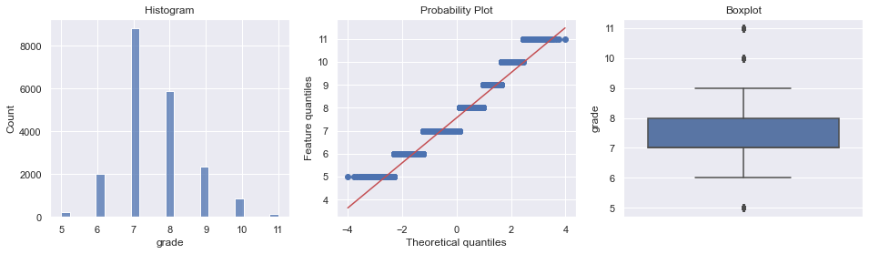
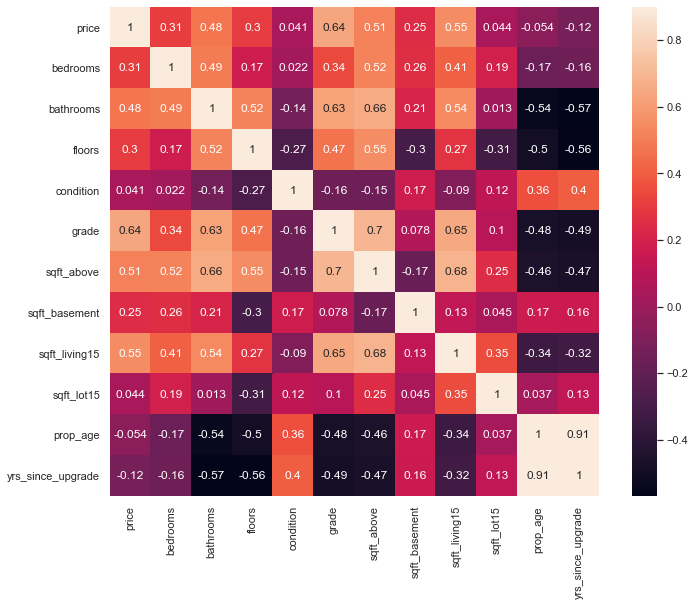

## House Price Regression Model

Please fill out:
* **Student name**: David Boyd
* **Student pace**: self paced 
* **Scheduled project review date/time**: N/A
* **Instructor name**: Abhineet Kulkarni


```python
import pandas as pd
import numpy as np
import matplotlib.pyplot as plt
import seaborn as sns
import datetime

from sklearn.model_selection import train_test_split
from sklearn.preprocessing import StandardScaler
import sklearn.metrics as metrics
from sklearn.metrics import r2_score
from sklearn.metrics import mean_squared_error

from scipy import stats
from scipy.stats import skew, boxcox_normmax
from scipy.special import boxcox1p, inv_boxcox1p

import statsmodels.api as sm

%matplotlib inline
```

## Useful Functions

Below are some functions that will be used later on, just grouping them at the top for readability purposes


```python
def diagnostic_plots(df, feature):
        '''
        Plots Histogram, Quartile Plot(Q-Q) and Boxplot 
        '''
        # define figure size
        plt.figure(figsize=(16, 4))

        # histogram
        plt.subplot(1, 3, 1)
        sns.histplot(df[feature], bins=25)
        plt.title('Histogram')

        # Q-Q plot
        plt.subplot(1, 3, 2)
        stats.probplot(df[feature], dist="norm", plot=plt)
        plt.ylabel('Feature quantiles')

        # boxplot
        plt.subplot(1, 3, 3)
        sns.boxplot(y=df[feature])
        plt.title('Boxplot')

        plt.show()
```


```python
def adjust_skewness(df):
        """
        Function takes in a dataframe and returns a dataframe which isn't impacted by skewness anymore
        """
        ## Getting all the data that are not of "object" type. 
        numeric = df.dtypes[df.dtypes != "object"].index

        # Check the skew of all numerical features
        skewed_feats = df[numeric].apply(lambda x: skew(x)).sort_values(ascending=False)
        high_skew = skewed_feats[abs(skewed_feats) > 0.5]
        skewed_features = high_skew.index
        
        for feat in skewed_features:
            df[feat] = boxcox1p(df[feat], boxcox_normmax(df[feat] + 1))
            print(f'for {feat} the lambda value is {boxcox_normmax(df[feat] + 1)}')
```

## EDA Phase

First things first, we want to explore the dataset that we have been given, this means:
- Understanding the features we've been given, the amount and their datatype
- Identifying what features are categorical and whether we need to OHE them
- Handling any null values
- Identifying and handling any outliers
- Understanding what are the options for each categorical variable


```python
df = pd.read_csv('data/kc_house_data.csv')
df.info()
```

    <class 'pandas.core.frame.DataFrame'>
    RangeIndex: 21597 entries, 0 to 21596
    Data columns (total 21 columns):
     #   Column         Non-Null Count  Dtype  
    ---  ------         --------------  -----  
     0   id             21597 non-null  int64  
     1   date           21597 non-null  object 
     2   price          21597 non-null  int64  
     3   bedrooms       21597 non-null  int64  
     4   bathrooms      21597 non-null  float64
     5   sqft_living    21597 non-null  int64  
     6   sqft_lot       21597 non-null  int64  
     7   floors         21597 non-null  float64
     8   waterfront     19221 non-null  object 
     9   view           21534 non-null  object 
     10  condition      21597 non-null  object 
     11  grade          21597 non-null  object 
     12  sqft_above     21597 non-null  int64  
     13  sqft_basement  21597 non-null  object 
     14  yr_built       21597 non-null  int64  
     15  yr_renovated   17755 non-null  float64
     16  zipcode        21597 non-null  int64  
     17  lat            21597 non-null  float64
     18  long           21597 non-null  float64
     19  sqft_living15  21597 non-null  int64  
     20  sqft_lot15     21597 non-null  int64  
    dtypes: float64(5), int64(10), object(6)
    memory usage: 3.5+ MB


```python
df.head()
```


<div>
<style scoped>
    .dataframe tbody tr th:only-of-type {
        vertical-align: middle;
    }

    .dataframe tbody tr th {
        vertical-align: top;
    }

    .dataframe thead th {
        text-align: right;
    }
</style>
<table border="1" class="dataframe">
  <thead>
    <tr style="text-align: right;">
      <th></th>
      <th>id</th>
      <th>date</th>
      <th>price</th>
      <th>bedrooms</th>
      <th>bathrooms</th>
      <th>sqft_living</th>
      <th>sqft_lot</th>
      <th>floors</th>
      <th>waterfront</th>
      <th>view</th>
      <th>...</th>
      <th>grade</th>
      <th>sqft_above</th>
      <th>sqft_basement</th>
      <th>yr_built</th>
      <th>yr_renovated</th>
      <th>zipcode</th>
      <th>lat</th>
      <th>long</th>
      <th>sqft_living15</th>
      <th>sqft_lot15</th>
    </tr>
  </thead>
  <tbody>
    <tr>
      <th>0</th>
      <td>7129300520</td>
      <td>10/13/2014</td>
      <td>221900</td>
      <td>3</td>
      <td>1.00</td>
      <td>1180</td>
      <td>5650</td>
      <td>1.0</td>
      <td>NaN</td>
      <td>NONE</td>
      <td>...</td>
      <td>7 Average</td>
      <td>1180</td>
      <td>0</td>
      <td>1955</td>
      <td>0.0</td>
      <td>98178</td>
      <td>47.5112</td>
      <td>-122.257</td>
      <td>1340</td>
      <td>5650</td>
    </tr>
    <tr>
      <th>1</th>
      <td>6414100192</td>
      <td>12/9/2014</td>
      <td>538000</td>
      <td>3</td>
      <td>2.25</td>
      <td>2570</td>
      <td>7242</td>
      <td>2.0</td>
      <td>NO</td>
      <td>NONE</td>
      <td>...</td>
      <td>7 Average</td>
      <td>2170</td>
      <td>400</td>
      <td>1951</td>
      <td>1991.0</td>
      <td>98125</td>
      <td>47.7210</td>
      <td>-122.319</td>
      <td>1690</td>
      <td>7639</td>
    </tr>
    <tr>
      <th>2</th>
      <td>5631500400</td>
      <td>2/25/2015</td>
      <td>180000</td>
      <td>2</td>
      <td>1.00</td>
      <td>770</td>
      <td>10000</td>
      <td>1.0</td>
      <td>NO</td>
      <td>NONE</td>
      <td>...</td>
      <td>6 Low Average</td>
      <td>770</td>
      <td>0</td>
      <td>1933</td>
      <td>NaN</td>
      <td>98028</td>
      <td>47.7379</td>
      <td>-122.233</td>
      <td>2720</td>
      <td>8062</td>
    </tr>
    <tr>
      <th>3</th>
      <td>2487200875</td>
      <td>12/9/2014</td>
      <td>604000</td>
      <td>4</td>
      <td>3.00</td>
      <td>1960</td>
      <td>5000</td>
      <td>1.0</td>
      <td>NO</td>
      <td>NONE</td>
      <td>...</td>
      <td>7 Average</td>
      <td>1050</td>
      <td>910</td>
      <td>1965</td>
      <td>0.0</td>
      <td>98136</td>
      <td>47.5208</td>
      <td>-122.393</td>
      <td>1360</td>
      <td>5000</td>
    </tr>
    <tr>
      <th>4</th>
      <td>1954400510</td>
      <td>2/18/2015</td>
      <td>510000</td>
      <td>3</td>
      <td>2.00</td>
      <td>1680</td>
      <td>8080</td>
      <td>1.0</td>
      <td>NO</td>
      <td>NONE</td>
      <td>...</td>
      <td>8 Good</td>
      <td>1680</td>
      <td>0</td>
      <td>1987</td>
      <td>0.0</td>
      <td>98074</td>
      <td>47.6168</td>
      <td>-122.045</td>
      <td>1800</td>
      <td>7503</td>
    </tr>
  </tbody>
</table>
<p>5 rows × 21 columns</p>
</div>


```python
# counting the number of null values per column
df.isnull().sum()
```


    id                  0
    date                0
    price               0
    bedrooms            0
    bathrooms           0
    sqft_living         0
    sqft_lot            0
    floors              0
    waterfront       2376
    view               63
    condition           0
    grade               0
    sqft_above          0
    sqft_basement       0
    yr_built            0
    yr_renovated     3842
    zipcode             0
    lat                 0
    long                0
    sqft_living15       0
    sqft_lot15          0
    dtype: int64


Looking at the above, we can see there are null values in yr_renovated, view, waterfront which need to be 
handled before potentially using them in a model. It is also clear that certain fields won't be useful to the model,
these are lat, long, date and id


```python
df.describe()
```


<div>
<style scoped>
    .dataframe tbody tr th:only-of-type {
        vertical-align: middle;
    }

    .dataframe tbody tr th {
        vertical-align: top;
    }

    .dataframe thead th {
        text-align: right;
    }
</style>
<table border="1" class="dataframe">
  <thead>
    <tr style="text-align: right;">
      <th></th>
      <th>id</th>
      <th>price</th>
      <th>bedrooms</th>
      <th>bathrooms</th>
      <th>sqft_living</th>
      <th>sqft_lot</th>
      <th>floors</th>
      <th>sqft_above</th>
      <th>yr_built</th>
      <th>yr_renovated</th>
      <th>zipcode</th>
      <th>lat</th>
      <th>long</th>
      <th>sqft_living15</th>
      <th>sqft_lot15</th>
    </tr>
  </thead>
  <tbody>
    <tr>
      <th>count</th>
      <td>2.159700e+04</td>
      <td>2.159700e+04</td>
      <td>21597.000000</td>
      <td>21597.000000</td>
      <td>21597.000000</td>
      <td>2.159700e+04</td>
      <td>21597.000000</td>
      <td>21597.000000</td>
      <td>21597.000000</td>
      <td>17755.000000</td>
      <td>21597.000000</td>
      <td>21597.000000</td>
      <td>21597.000000</td>
      <td>21597.000000</td>
      <td>21597.000000</td>
    </tr>
    <tr>
      <th>mean</th>
      <td>4.580474e+09</td>
      <td>5.402966e+05</td>
      <td>3.373200</td>
      <td>2.115826</td>
      <td>2080.321850</td>
      <td>1.509941e+04</td>
      <td>1.494096</td>
      <td>1788.596842</td>
      <td>1970.999676</td>
      <td>83.636778</td>
      <td>98077.951845</td>
      <td>47.560093</td>
      <td>-122.213982</td>
      <td>1986.620318</td>
      <td>12758.283512</td>
    </tr>
    <tr>
      <th>std</th>
      <td>2.876736e+09</td>
      <td>3.673681e+05</td>
      <td>0.926299</td>
      <td>0.768984</td>
      <td>918.106125</td>
      <td>4.141264e+04</td>
      <td>0.539683</td>
      <td>827.759761</td>
      <td>29.375234</td>
      <td>399.946414</td>
      <td>53.513072</td>
      <td>0.138552</td>
      <td>0.140724</td>
      <td>685.230472</td>
      <td>27274.441950</td>
    </tr>
    <tr>
      <th>min</th>
      <td>1.000102e+06</td>
      <td>7.800000e+04</td>
      <td>1.000000</td>
      <td>0.500000</td>
      <td>370.000000</td>
      <td>5.200000e+02</td>
      <td>1.000000</td>
      <td>370.000000</td>
      <td>1900.000000</td>
      <td>0.000000</td>
      <td>98001.000000</td>
      <td>47.155900</td>
      <td>-122.519000</td>
      <td>399.000000</td>
      <td>651.000000</td>
    </tr>
    <tr>
      <th>25%</th>
      <td>2.123049e+09</td>
      <td>3.220000e+05</td>
      <td>3.000000</td>
      <td>1.750000</td>
      <td>1430.000000</td>
      <td>5.040000e+03</td>
      <td>1.000000</td>
      <td>1190.000000</td>
      <td>1951.000000</td>
      <td>0.000000</td>
      <td>98033.000000</td>
      <td>47.471100</td>
      <td>-122.328000</td>
      <td>1490.000000</td>
      <td>5100.000000</td>
    </tr>
    <tr>
      <th>50%</th>
      <td>3.904930e+09</td>
      <td>4.500000e+05</td>
      <td>3.000000</td>
      <td>2.250000</td>
      <td>1910.000000</td>
      <td>7.618000e+03</td>
      <td>1.500000</td>
      <td>1560.000000</td>
      <td>1975.000000</td>
      <td>0.000000</td>
      <td>98065.000000</td>
      <td>47.571800</td>
      <td>-122.231000</td>
      <td>1840.000000</td>
      <td>7620.000000</td>
    </tr>
    <tr>
      <th>75%</th>
      <td>7.308900e+09</td>
      <td>6.450000e+05</td>
      <td>4.000000</td>
      <td>2.500000</td>
      <td>2550.000000</td>
      <td>1.068500e+04</td>
      <td>2.000000</td>
      <td>2210.000000</td>
      <td>1997.000000</td>
      <td>0.000000</td>
      <td>98118.000000</td>
      <td>47.678000</td>
      <td>-122.125000</td>
      <td>2360.000000</td>
      <td>10083.000000</td>
    </tr>
    <tr>
      <th>max</th>
      <td>9.900000e+09</td>
      <td>7.700000e+06</td>
      <td>33.000000</td>
      <td>8.000000</td>
      <td>13540.000000</td>
      <td>1.651359e+06</td>
      <td>3.500000</td>
      <td>9410.000000</td>
      <td>2015.000000</td>
      <td>2015.000000</td>
      <td>98199.000000</td>
      <td>47.777600</td>
      <td>-121.315000</td>
      <td>6210.000000</td>
      <td>871200.000000</td>
    </tr>
  </tbody>
</table>
</div>


Looking at the describe function above, we can see some clear outliers across several features, which will need handling before building an effective model


```python
df_cat = df[['waterfront', 'view', 'condition', 'grade', 'yr_renovated', 'sqft_basement']]
df_cat.head()
```


<div>
<style scoped>
    .dataframe tbody tr th:only-of-type {
        vertical-align: middle;
    }

    .dataframe tbody tr th {
        vertical-align: top;
    }

    .dataframe thead th {
        text-align: right;
    }
</style>
<table border="1" class="dataframe">
  <thead>
    <tr style="text-align: right;">
      <th></th>
      <th>waterfront</th>
      <th>view</th>
      <th>condition</th>
      <th>grade</th>
      <th>yr_renovated</th>
      <th>sqft_basement</th>
    </tr>
  </thead>
  <tbody>
    <tr>
      <th>0</th>
      <td>NaN</td>
      <td>NONE</td>
      <td>Average</td>
      <td>7 Average</td>
      <td>0.0</td>
      <td>0</td>
    </tr>
    <tr>
      <th>1</th>
      <td>NO</td>
      <td>NONE</td>
      <td>Average</td>
      <td>7 Average</td>
      <td>1991.0</td>
      <td>400</td>
    </tr>
    <tr>
      <th>2</th>
      <td>NO</td>
      <td>NONE</td>
      <td>Average</td>
      <td>6 Low Average</td>
      <td>NaN</td>
      <td>0</td>
    </tr>
    <tr>
      <th>3</th>
      <td>NO</td>
      <td>NONE</td>
      <td>Very Good</td>
      <td>7 Average</td>
      <td>0.0</td>
      <td>910</td>
    </tr>
    <tr>
      <th>4</th>
      <td>NO</td>
      <td>NONE</td>
      <td>Average</td>
      <td>8 Good</td>
      <td>0.0</td>
      <td>0</td>
    </tr>
  </tbody>
</table>
</div>


```python
for col in df_cat.columns:
    print(df_cat[col].unique()) # to print categories name only
    print(df_cat[col].value_counts()) # to print count of every category
```

    [nan 'NO' 'YES']
    NO     19075
    YES      146
    Name: waterfront, dtype: int64
    ['NONE' nan 'GOOD' 'EXCELLENT' 'AVERAGE' 'FAIR']
    NONE         19422
    AVERAGE        957
    GOOD           508
    FAIR           330
    EXCELLENT      317
    Name: view, dtype: int64
    ['Average' 'Very Good' 'Good' 'Poor' 'Fair']
    Average      14020
    Good          5677
    Very Good     1701
    Fair           170
    Poor            29
    Name: condition, dtype: int64
    ['7 Average' '6 Low Average' '8 Good' '11 Excellent' '9 Better' '5 Fair'
     '10 Very Good' '12 Luxury' '4 Low' '3 Poor' '13 Mansion']
    7 Average        8974
    8 Good           6065
    9 Better         2615
    6 Low Average    2038
    10 Very Good     1134
    11 Excellent      399
    5 Fair            242
    12 Luxury          89
    4 Low              27
    13 Mansion         13
    3 Poor              1
    Name: grade, dtype: int64
    [   0. 1991.   nan 2002. 2010. 1992. 2013. 1994. 1978. 2005. 2003. 1984.
     1954. 2014. 2011. 1983. 1945. 1990. 1988. 1977. 1981. 1995. 2000. 1999.
     1998. 1970. 1989. 2004. 1986. 2007. 1987. 2006. 1985. 2001. 1980. 1971.
     1979. 1997. 1950. 1969. 1948. 2009. 2015. 1974. 2008. 1968. 2012. 1963.
     1951. 1962. 1953. 1993. 1996. 1955. 1982. 1956. 1940. 1976. 1946. 1975.
     1964. 1973. 1957. 1959. 1960. 1967. 1965. 1934. 1972. 1944. 1958.]
    0.0       17011
    2014.0       73
    2003.0       31
    2013.0       31
    2007.0       30
              ...  
    1946.0        1
    1959.0        1
    1971.0        1
    1951.0        1
    1954.0        1
    Name: yr_renovated, Length: 70, dtype: int64
    ['0' '400' '910' '1530' '?' '730' '1700' '300' '970' '760' '720' '700'
     '820' '780' '790' '330' '1620' '360' '588' '1510' '410' '990' '600' '560'
     '550' '1000' '1600' '500' '1040' '880' '1010' '240' '265' '290' '800'
     '540' '710' '840' '380' '770' '480' '570' '1490' '620' '1250' '1270'
     '120' '650' '180' '1130' '450' '1640' '1460' '1020' '1030' '750' '640'
     '1070' '490' '1310' '630' '2000' '390' '430' '850' '210' '1430' '1950'
     '440' '220' '1160' '860' '580' '2060' '1820' '1180' '200' '1150' '1200'
     '680' '530' '1450' '1170' '1080' '960' '280' '870' '1100' '460' '1400'
     '660' '1220' '900' '420' '1580' '1380' '475' '690' '270' '350' '935'
     '1370' '980' '1470' '160' '950' '50' '740' '1780' '1900' '340' '470'
     '370' '140' '1760' '130' '520' '890' '1110' '150' '1720' '810' '190'
     '1290' '670' '1800' '1120' '1810' '60' '1050' '940' '310' '930' '1390'
     '610' '1830' '1300' '510' '1330' '1590' '920' '1320' '1420' '1240' '1960'
     '1560' '2020' '1190' '2110' '1280' '250' '2390' '1230' '170' '830' '1260'
     '1410' '1340' '590' '1500' '1140' '260' '100' '320' '1480' '1060' '1284'
     '1670' '1350' '2570' '1090' '110' '2500' '90' '1940' '1550' '2350' '2490'
     '1481' '1360' '1135' '1520' '1850' '1660' '2130' '2600' '1690' '243'
     '1210' '1024' '1798' '1610' '1440' '1570' '1650' '704' '1910' '1630'
     '2360' '1852' '2090' '2400' '1790' '2150' '230' '70' '1680' '2100' '3000'
     '1870' '1710' '2030' '875' '1540' '2850' '2170' '506' '906' '145' '2040'
     '784' '1750' '374' '518' '2720' '2730' '1840' '3480' '2160' '1920' '2330'
     '1860' '2050' '4820' '1913' '80' '2010' '3260' '2200' '415' '1730' '652'
     '2196' '1930' '515' '40' '2080' '2580' '1548' '1740' '235' '861' '1890'
     '2220' '792' '2070' '4130' '2250' '2240' '1990' '768' '2550' '435' '1008'
     '2300' '2610' '666' '3500' '172' '1816' '2190' '1245' '1525' '1880' '862'
     '946' '1281' '414' '2180' '276' '1248' '602' '516' '176' '225' '1275'
     '266' '283' '65' '2310' '10' '1770' '2120' '295' '207' '915' '556' '417'
     '143' '508' '2810' '20' '274' '248']
    0       12826
    ?         454
    600       217
    500       209
    700       208
            ...  
    1275        1
    225         1
    243         1
    274         1
    875         1
    Name: sqft_basement, Length: 304, dtype: int64


We can see multiple issues inside our categorical variables, these are:
- sqft_basement having a ? option, these need removing
- yr_renovated having a nan option
- Extracting/converting the grade & condition features into numerics

## Preprocessing Stage

Looking at the above tables there are several steps to complete in this section, which have been listed below:
- Clean up the missing values on the yr_renovated column, assume is NAN then it hasn't been renovated, so 0 will be inputted.
- Using the date, pull out the yr_sold to help calculate the age of the property at sale, years since renovation
- Create booleans to identify if it has had a renovation, or if the property has a basement, to show roughly what extra value they add to a property (considered with the age/size of each feature later on)

Once the steps above have been completed we are able to look at the correlation between different features with the price. This will help us determine which features we are able to drop, then can begin on encoding any categorical columns left.


```python
df['date'] = pd.to_datetime(df['date'])
df['yr_sold'] = df['date'].dt.year

# calculating property age
df['prop_age'] = abs(df['yr_sold'] - df['yr_built'])
# filling missing renovated values with 0, as assumed they didn't get renovated
df['yr_renovated'].fillna(0, inplace=True)
```


```python
# calculating number of years since upgrade/renovation
df['yrs_since_upgrade'] = np.where(df['yr_renovated'] == 0, df['prop_age'],
                          np.where(df['yr_renovated'] != 0, abs(df['yr_sold'] - df['yr_renovated']), 0))

# boolean of whether a renovation happened or not
df['had_upgrade'] = np.where(df['yr_renovated'] == 0, "No",
                          np.where(df['yr_renovated'] != 0, "Yes", "No"))

# boolean of whether it has a basement or not
df['has_basement'] = np.where(df['sqft_basement'].isin([0,'?']) , "No",
                          np.where(df['sqft_basement'] != 0, "Yes", "No"))

# calculating square footage of basement
df['sqft_basement'] = df['sqft_living'] - df['sqft_above']

```


```python
df.info()
```

    <class 'pandas.core.frame.DataFrame'>
    RangeIndex: 21597 entries, 0 to 21596
    Data columns (total 26 columns):
     #   Column             Non-Null Count  Dtype         
    ---  ------             --------------  -----         
     0   id                 21597 non-null  int64         
     1   date               21597 non-null  datetime64[ns]
     2   price              21597 non-null  int64         
     3   bedrooms           21597 non-null  int64         
     4   bathrooms          21597 non-null  float64       
     5   sqft_living        21597 non-null  int64         
     6   sqft_lot           21597 non-null  int64         
     7   floors             21597 non-null  float64       
     8   waterfront         19221 non-null  object        
     9   view               21534 non-null  object        
     10  condition          21597 non-null  object        
     11  grade              21597 non-null  object        
     12  sqft_above         21597 non-null  int64         
     13  sqft_basement      21597 non-null  int64         
     14  yr_built           21597 non-null  int64         
     15  yr_renovated       21597 non-null  float64       
     16  zipcode            21597 non-null  int64         
     17  lat                21597 non-null  float64       
     18  long               21597 non-null  float64       
     19  sqft_living15      21597 non-null  int64         
     20  sqft_lot15         21597 non-null  int64         
     21  yr_sold            21597 non-null  int64         
     22  prop_age           21597 non-null  int64         
     23  yrs_since_upgrade  21597 non-null  float64       
     24  had_upgrade        21597 non-null  object        
     25  has_basement       21597 non-null  object        
    dtypes: datetime64[ns](1), float64(6), int64(13), object(6)
    memory usage: 4.3+ MB


```python
# Dropping all unneccesary columns
df = df.drop(['id','date', 'waterfront', 'view', 'zipcode', 'lat', 'long', 'yr_renovated', 'sqft_living', 'sqft_lot', 'yr_built', 'yr_sold'], axis=1)
```


```python
df.info()
```

    <class 'pandas.core.frame.DataFrame'>
    RangeIndex: 21597 entries, 0 to 21596
    Data columns (total 14 columns):
     #   Column             Non-Null Count  Dtype  
    ---  ------             --------------  -----  
     0   price              21597 non-null  int64  
     1   bedrooms           21597 non-null  int64  
     2   bathrooms          21597 non-null  float64
     3   floors             21597 non-null  float64
     4   condition          21597 non-null  object 
     5   grade              21597 non-null  object 
     6   sqft_above         21597 non-null  int64  
     7   sqft_basement      21597 non-null  int64  
     8   sqft_living15      21597 non-null  int64  
     9   sqft_lot15         21597 non-null  int64  
     10  prop_age           21597 non-null  int64  
     11  yrs_since_upgrade  21597 non-null  float64
     12  had_upgrade        21597 non-null  object 
     13  has_basement       21597 non-null  object 
    dtypes: float64(3), int64(7), object(4)
    memory usage: 2.3+ MB


```python
cond_dict = {'Poor':1, 'Fair':2, 'Average':3, 'Good':4, 'Very Good':5}

# converting condition into a numerical column using a dict
df.replace({"condition": cond_dict}, inplace=True)
df['condition'] = df['condition'].astype(int)
```


```python
grade_dict = {'3 Poor':3, 
              '4 Low':4, 
              '5 Fair':5, 
              '6 Low Average':6,
              '7 Average':7,
              '8 Good':8,
              '9 Better':9,
              '10 Very Good':10,
              '11 Excellent':11,
              '12 Luxury':12,
              '13 Mansion':13}

# converting grade into a numerical column using a dict
df.replace({"grade": grade_dict}, inplace=True)
df['grade'] = df['grade'].astype(int)
df.info()
```

    <class 'pandas.core.frame.DataFrame'>
    RangeIndex: 21597 entries, 0 to 21596
    Data columns (total 14 columns):
     #   Column             Non-Null Count  Dtype  
    ---  ------             --------------  -----  
     0   price              21597 non-null  int64  
     1   bedrooms           21597 non-null  int64  
     2   bathrooms          21597 non-null  float64
     3   floors             21597 non-null  float64
     4   condition          21597 non-null  int64  
     5   grade              21597 non-null  int64  
     6   sqft_above         21597 non-null  int64  
     7   sqft_basement      21597 non-null  int64  
     8   sqft_living15      21597 non-null  int64  
     9   sqft_lot15         21597 non-null  int64  
     10  prop_age           21597 non-null  int64  
     11  yrs_since_upgrade  21597 non-null  float64
     12  had_upgrade        21597 non-null  object 
     13  has_basement       21597 non-null  object 
    dtypes: float64(3), int64(9), object(2)
    memory usage: 2.3+ MB


Time to visualise each of the numeric columns left to understand whether they are normally distributed or not.


```python
# Plot the Correlation map to see how features are correlated with target: Price
corr_matrix = df.corr()
plt.subplots(figsize=(12,9))
sns.heatmap(corr_matrix, vmax=0.9, square=True, annot=True)
```


    <AxesSubplot:>


    

    


```python
sns.set()
cols = ['price', 'bedrooms', 'bathrooms','sqft_above', 'sqft_basement' ,'grade','condition',
        'floors', 'prop_age', 'yrs_since_upgrade', 'sqft_living15']

# quickly visualising what relationship features have with each other
sns.pairplot(df[cols], height = 2.5)
plt.show();
```


    

    


## Handling Outliers

After handling the outliers, we need to handle the following aspects:
- Numeric data needs to be standardised
- Categorical data needs to be one hot encoded/binary encoded
- Transform the price to remove skewness


```python
df_numeric = df.select_dtypes(exclude = 'object')

# calculting the z-score for all numeric columns to exclude outliers
z_score = np.abs(stats.zscore(df_numeric))
no_outliers = (z_score < 3).all(axis = 1)
df_filtered = df_numeric[no_outliers]
df_filtered.head()
```


<div>
<style scoped>
    .dataframe tbody tr th:only-of-type {
        vertical-align: middle;
    }

    .dataframe tbody tr th {
        vertical-align: top;
    }

    .dataframe thead th {
        text-align: right;
    }
</style>
<table border="1" class="dataframe">
  <thead>
    <tr style="text-align: right;">
      <th></th>
      <th>price</th>
      <th>bedrooms</th>
      <th>bathrooms</th>
      <th>floors</th>
      <th>condition</th>
      <th>grade</th>
      <th>sqft_above</th>
      <th>sqft_basement</th>
      <th>sqft_living15</th>
      <th>sqft_lot15</th>
      <th>prop_age</th>
      <th>yrs_since_upgrade</th>
    </tr>
  </thead>
  <tbody>
    <tr>
      <th>0</th>
      <td>221900</td>
      <td>3</td>
      <td>1.00</td>
      <td>1.0</td>
      <td>3</td>
      <td>7</td>
      <td>1180</td>
      <td>0</td>
      <td>1340</td>
      <td>5650</td>
      <td>59</td>
      <td>59.0</td>
    </tr>
    <tr>
      <th>1</th>
      <td>538000</td>
      <td>3</td>
      <td>2.25</td>
      <td>2.0</td>
      <td>3</td>
      <td>7</td>
      <td>2170</td>
      <td>400</td>
      <td>1690</td>
      <td>7639</td>
      <td>63</td>
      <td>23.0</td>
    </tr>
    <tr>
      <th>2</th>
      <td>180000</td>
      <td>2</td>
      <td>1.00</td>
      <td>1.0</td>
      <td>3</td>
      <td>6</td>
      <td>770</td>
      <td>0</td>
      <td>2720</td>
      <td>8062</td>
      <td>82</td>
      <td>82.0</td>
    </tr>
    <tr>
      <th>3</th>
      <td>604000</td>
      <td>4</td>
      <td>3.00</td>
      <td>1.0</td>
      <td>5</td>
      <td>7</td>
      <td>1050</td>
      <td>910</td>
      <td>1360</td>
      <td>5000</td>
      <td>49</td>
      <td>49.0</td>
    </tr>
    <tr>
      <th>4</th>
      <td>510000</td>
      <td>3</td>
      <td>2.00</td>
      <td>1.0</td>
      <td>3</td>
      <td>8</td>
      <td>1680</td>
      <td>0</td>
      <td>1800</td>
      <td>7503</td>
      <td>28</td>
      <td>28.0</td>
    </tr>
  </tbody>
</table>
</div>


```python
features = ['bedrooms', 'bathrooms', 'sqft_above', 'sqft_basement', 'floors',
       'condition', 'grade', 'prop_age', 'yrs_since_upgrade', 'sqft_living15']

# checking for whether features are linear or not and whether features are skewed 
for feat in features:
    diagnostic_plots(df_filtered,feat)
```


    

    


    

    


    

    


    

    


    

    


    

    


    

    


    

    


    

    


    

    


```python
# removing skewness of features
adjust_skewness(df_filtered)
```

    /Users/davidboyd/opt/anaconda3/envs/learn-env/lib/python3.8/site-packages/scipy/stats/stats.py:3845: PearsonRConstantInputWarning: An input array is constant; the correlation coefficent is not defined.
      warnings.warn(PearsonRConstantInputWarning())
    <ipython-input-3-f3db2a709ae3>:14: SettingWithCopyWarning: 
    A value is trying to be set on a copy of a slice from a DataFrame.
    Try using .loc[row_indexer,col_indexer] = value instead
    
    See the caveats in the documentation: https://pandas.pydata.org/pandas-docs/stable/user_guide/indexing.html#returning-a-view-versus-a-copy
      df[feat] = boxcox1p(df[feat], boxcox_normmax(df[feat] + 1))


    for sqft_lot15 the lambda value is 1.1371715742807809
    for price the lambda value is 0.9784635941282755
    for sqft_basement the lambda value is 0.9987136051377098
    for condition the lambda value is 0.9177283015573858
    for sqft_above the lambda value is 0.7422674506937296
    for sqft_living15 the lambda value is 0.9169760112006394
    for floors the lambda value is 0.9978639576035712
    for grade the lambda value is 1.0354208023687301
    for yrs_since_upgrade the lambda value is 0.9889168982012952


```python
corr_matrix = df_filtered.corr()
plt.subplots(figsize=(12,9))
sns.heatmap(corr_matrix, vmax=0.9, square=True, annot=True)
```


    <AxesSubplot:>


    

    


```python
X = df_filtered.drop('price', axis=1)
y = df_filtered['price']
```


```python
features = ['bedrooms', 'bathrooms', 'sqft_above', 'sqft_basement', 'floors',
       'condition', 'grade', 'prop_age', 'yrs_since_upgrade', 'sqft_living15']

# checking features skew and linearity violations have been fixed via transformations
for feat in features:
    diagnostic_plots(X,feat)
```


    

    


    

    


    

    


    

    


    

    


    

    


    

    


    

    


    

    


    

    


```python
plt.figure(figsize=(16, 4))

        # histogram
plt.subplot(1, 3, 1)
sns.histplot(y, bins=25)
plt.title('Histogram')

        # Q-Q plot
plt.subplot(1, 3, 2)
stats.probplot(y, dist="norm", plot=plt)
plt.ylabel('Feature quantiles')

        # boxplot
plt.subplot(1, 3, 3)
sns.boxplot(y=y)
plt.title('Boxplot')

plt.show()
```


    

    


```python
# dropping non-linear features
X = X.drop(['yrs_since_upgrade', 'prop_age', 'sqft_basement'], axis=1)
```


```python
df_cat = df.loc[X.index]
df_cat = df_cat.select_dtypes(include = 'object')
df_cat.head()

from sklearn.preprocessing import LabelBinarizer

# Create a binarizer object for each binary categorical variable
upgrade_bin = LabelBinarizer()
basement_bin = LabelBinarizer()

# Fit and transform each respective binary cat variable to their respective binarizer objects
df_cat['had_upgrade'] = upgrade_bin.fit_transform(df_cat['had_upgrade'])
df_cat['has_basement'] = basement_bin.fit_transform(df_cat['has_basement'])

df_cat.head()
```


<div>
<style scoped>
    .dataframe tbody tr th:only-of-type {
        vertical-align: middle;
    }

    .dataframe tbody tr th {
        vertical-align: top;
    }

    .dataframe thead th {
        text-align: right;
    }
</style>
<table border="1" class="dataframe">
  <thead>
    <tr style="text-align: right;">
      <th></th>
      <th>had_upgrade</th>
      <th>has_basement</th>
    </tr>
  </thead>
  <tbody>
    <tr>
      <th>0</th>
      <td>0</td>
      <td>1</td>
    </tr>
    <tr>
      <th>1</th>
      <td>1</td>
      <td>1</td>
    </tr>
    <tr>
      <th>2</th>
      <td>0</td>
      <td>1</td>
    </tr>
    <tr>
      <th>3</th>
      <td>0</td>
      <td>1</td>
    </tr>
    <tr>
      <th>4</th>
      <td>0</td>
      <td>1</td>
    </tr>
  </tbody>
</table>
</div>


```python
# Merge numerical data and categorical data
X_prep = pd.merge(df_cat, X, left_index = True, right_index = True)
X_prep.head()
```


<div>
<style scoped>
    .dataframe tbody tr th:only-of-type {
        vertical-align: middle;
    }

    .dataframe tbody tr th {
        vertical-align: top;
    }

    .dataframe thead th {
        text-align: right;
    }
</style>
<table border="1" class="dataframe">
  <thead>
    <tr style="text-align: right;">
      <th></th>
      <th>had_upgrade</th>
      <th>has_basement</th>
      <th>bedrooms</th>
      <th>bathrooms</th>
      <th>floors</th>
      <th>condition</th>
      <th>grade</th>
      <th>sqft_above</th>
      <th>sqft_living15</th>
      <th>sqft_lot15</th>
    </tr>
  </thead>
  <tbody>
    <tr>
      <th>0</th>
      <td>0</td>
      <td>1</td>
      <td>3</td>
      <td>1.00</td>
      <td>0.853018</td>
      <td>0.908772</td>
      <td>1.689392</td>
      <td>3.686960</td>
      <td>4.663428</td>
      <td>6.828133</td>
    </tr>
    <tr>
      <th>1</th>
      <td>1</td>
      <td>1</td>
      <td>3</td>
      <td>2.25</td>
      <td>1.535993</td>
      <td>0.908772</td>
      <td>1.689392</td>
      <td>3.816627</td>
      <td>4.752436</td>
      <td>7.011192</td>
    </tr>
    <tr>
      <th>2</th>
      <td>0</td>
      <td>1</td>
      <td>2</td>
      <td>1.00</td>
      <td>0.853018</td>
      <td>0.908772</td>
      <td>1.601396</td>
      <td>3.585761</td>
      <td>4.926768</td>
      <td>7.043575</td>
    </tr>
    <tr>
      <th>3</th>
      <td>0</td>
      <td>1</td>
      <td>4</td>
      <td>3.00</td>
      <td>0.853018</td>
      <td>1.051467</td>
      <td>1.689392</td>
      <td>3.660177</td>
      <td>4.669191</td>
      <td>6.753060</td>
    </tr>
    <tr>
      <th>4</th>
      <td>0</td>
      <td>1</td>
      <td>3</td>
      <td>2.00</td>
      <td>0.853018</td>
      <td>0.908772</td>
      <td>1.765015</td>
      <td>3.764156</td>
      <td>4.776161</td>
      <td>7.000376</td>
    </tr>
  </tbody>
</table>
</div>


## Regression Modelling

### Baseline Model


```python
X_train, X_test, y_train, y_test = train_test_split(X_prep['sqft_above'], y, test_size=0.2, random_state=51)
```


```python
from sklearn.linear_model import LinearRegression
regr = LinearRegression()
# Train the model using the training sets
regr.fit(X_train.values.reshape(-1,1), y_train)

# Make predictions using the testing set
y_test_pred = regr.predict(X_test.values.reshape(-1,1))
y_train_pred = regr.predict(X_train.values.reshape(-1,1))
```


```python
print('MSE train: %.3f, test: %.3f' % (
        mean_squared_error(y_train, y_train_pred),
        mean_squared_error(y_test, y_test_pred)))
print('R^2 train: %.3f, test: %.3f' % (
        r2_score(y_train, y_train_pred),
        r2_score(y_test, y_test_pred)))
```

    MSE train: 0.061, test: 0.059
    R^2 train: 0.265, test: 0.249


```python
# Create model intercept
feats_with_int = sm.add_constant(X_train)

# Fit model to data
model1 = sm.OLS(y_train,feats_with_int).fit()
model1.summary()
```


<table class="simpletable">
<caption>OLS Regression Results</caption>
<tr>
  <th>Dep. Variable:</th>          <td>price</td>      <th>  R-squared:         </th> <td>   0.265</td>
</tr>
<tr>
  <th>Model:</th>                   <td>OLS</td>       <th>  Adj. R-squared:    </th> <td>   0.265</td>
</tr>
<tr>
  <th>Method:</th>             <td>Least Squares</td>  <th>  F-statistic:       </th> <td>   5848.</td>
</tr>
<tr>
  <th>Date:</th>             <td>Wed, 09 Nov 2022</td> <th>  Prob (F-statistic):</th>  <td>  0.00</td> 
</tr>
<tr>
  <th>Time:</th>                 <td>22:14:52</td>     <th>  Log-Likelihood:    </th> <td> -352.54</td>
</tr>
<tr>
  <th>No. Observations:</th>      <td> 16236</td>      <th>  AIC:               </th> <td>   709.1</td>
</tr>
<tr>
  <th>Df Residuals:</th>          <td> 16234</td>      <th>  BIC:               </th> <td>   724.5</td>
</tr>
<tr>
  <th>Df Model:</th>              <td>     1</td>      <th>                     </th>     <td> </td>   
</tr>
<tr>
  <th>Covariance Type:</th>      <td>nonrobust</td>    <th>                     </th>     <td> </td>   
</tr>
</table>
<table class="simpletable">
<tr>
       <td></td>         <th>coef</th>     <th>std err</th>      <th>t</th>      <th>P>|t|</th>  <th>[0.025</th>    <th>0.975]</th>  
</tr>
<tr>
  <th>const</th>      <td>    3.7010</td> <td>    0.086</td> <td>   43.254</td> <td> 0.000</td> <td>    3.533</td> <td>    3.869</td>
</tr>
<tr>
  <th>sqft_above</th> <td>    1.7460</td> <td>    0.023</td> <td>   76.474</td> <td> 0.000</td> <td>    1.701</td> <td>    1.791</td>
</tr>
</table>
<table class="simpletable">
<tr>
  <th>Omnibus:</th>       <td>236.636</td> <th>  Durbin-Watson:     </th> <td>   1.965</td>
</tr>
<tr>
  <th>Prob(Omnibus):</th> <td> 0.000</td>  <th>  Jarque-Bera (JB):  </th> <td> 140.295</td>
</tr>
<tr>
  <th>Skew:</th>          <td>-0.035</td>  <th>  Prob(JB):          </th> <td>3.43e-31</td>
</tr>
<tr>
  <th>Kurtosis:</th>      <td> 2.550</td>  <th>  Cond. No.          </th> <td>    177.</td>
</tr>
</table><br/><br/>Notes:<br/>[1] Standard Errors assume that the covariance matrix of the errors is correctly specified.


### Iteration 1 - All features


```python
X_train1, X_test1, y_train1, y_test1 = train_test_split(X_prep, y, test_size=0.2, random_state=51)
```


```python
regr = LinearRegression()
# Train the model using the training sets
regr.fit(X_train1, y_train1)

# Make predictions using the testing set
y_test_pred1 = regr.predict(X_test1)
y_train_pred1 = regr.predict(X_train1)
```


```python
print('MSE train: %.3f, test: %.3f' % (
        mean_squared_error(y_train1, y_train_pred1),
        mean_squared_error(y_test1, y_test_pred1)))
print('R^2 train: %.3f, test: %.3f' % (
        r2_score(y_train1, y_train_pred1),
        r2_score(y_test1, y_test_pred1)))
```

    MSE train: 0.042, test: 0.042
    R^2 train: 0.493, test: 0.474


```python
# Create model intercept
feats_with_int1 = sm.add_constant(X_train1)

# Fit model to data
model2 = sm.OLS(y_train1,feats_with_int1).fit()
model2.summary()
```


<table class="simpletable">
<caption>OLS Regression Results</caption>
<tr>
  <th>Dep. Variable:</th>          <td>price</td>      <th>  R-squared:         </th> <td>   0.493</td>
</tr>
<tr>
  <th>Model:</th>                   <td>OLS</td>       <th>  Adj. R-squared:    </th> <td>   0.492</td>
</tr>
<tr>
  <th>Method:</th>             <td>Least Squares</td>  <th>  F-statistic:       </th> <td>   1575.</td>
</tr>
<tr>
  <th>Date:</th>             <td>Wed, 09 Nov 2022</td> <th>  Prob (F-statistic):</th>  <td>  0.00</td> 
</tr>
<tr>
  <th>Time:</th>                 <td>22:14:53</td>     <th>  Log-Likelihood:    </th> <td>  2657.2</td>
</tr>
<tr>
  <th>No. Observations:</th>      <td> 16236</td>      <th>  AIC:               </th> <td>  -5292.</td>
</tr>
<tr>
  <th>Df Residuals:</th>          <td> 16225</td>      <th>  BIC:               </th> <td>  -5208.</td>
</tr>
<tr>
  <th>Df Model:</th>              <td>    10</td>      <th>                     </th>     <td> </td>   
</tr>
<tr>
  <th>Covariance Type:</th>      <td>nonrobust</td>    <th>                     </th>     <td> </td>   
</tr>
</table>
<table class="simpletable">
<tr>
        <td></td>           <th>coef</th>     <th>std err</th>      <th>t</th>      <th>P>|t|</th>  <th>[0.025</th>    <th>0.975]</th>  
</tr>
<tr>
  <th>const</th>         <td>    3.0831</td> <td>    0.115</td> <td>   26.747</td> <td> 0.000</td> <td>    2.857</td> <td>    3.309</td>
</tr>
<tr>
  <th>had_upgrade</th>   <td>    0.1708</td> <td>    0.009</td> <td>   18.793</td> <td> 0.000</td> <td>    0.153</td> <td>    0.189</td>
</tr>
<tr>
  <th>has_basement</th>  <td>   -0.0014</td> <td>    0.011</td> <td>   -0.123</td> <td> 0.902</td> <td>   -0.024</td> <td>    0.021</td>
</tr>
<tr>
  <th>bedrooms</th>      <td>    0.0086</td> <td>    0.002</td> <td>    3.622</td> <td> 0.000</td> <td>    0.004</td> <td>    0.013</td>
</tr>
<tr>
  <th>bathrooms</th>     <td>    0.0183</td> <td>    0.004</td> <td>    5.131</td> <td> 0.000</td> <td>    0.011</td> <td>    0.025</td>
</tr>
<tr>
  <th>floors</th>        <td>   -0.0396</td> <td>    0.007</td> <td>   -5.828</td> <td> 0.000</td> <td>   -0.053</td> <td>   -0.026</td>
</tr>
<tr>
  <th>condition</th>     <td>    0.9698</td> <td>    0.034</td> <td>   28.782</td> <td> 0.000</td> <td>    0.904</td> <td>    1.036</td>
</tr>
<tr>
  <th>grade</th>         <td>    1.6700</td> <td>    0.033</td> <td>   50.745</td> <td> 0.000</td> <td>    1.606</td> <td>    1.735</td>
</tr>
<tr>
  <th>sqft_above</th>    <td>    0.2195</td> <td>    0.037</td> <td>    5.888</td> <td> 0.000</td> <td>    0.146</td> <td>    0.293</td>
</tr>
<tr>
  <th>sqft_living15</th> <td>    0.6820</td> <td>    0.022</td> <td>   31.284</td> <td> 0.000</td> <td>    0.639</td> <td>    0.725</td>
</tr>
<tr>
  <th>sqft_lot15</th>    <td>   -0.1066</td> <td>    0.005</td> <td>  -21.671</td> <td> 0.000</td> <td>   -0.116</td> <td>   -0.097</td>
</tr>
</table>
<table class="simpletable">
<tr>
  <th>Omnibus:</th>       <td>24.212</td> <th>  Durbin-Watson:     </th> <td>   1.973</td>
</tr>
<tr>
  <th>Prob(Omnibus):</th> <td> 0.000</td> <th>  Jarque-Bera (JB):  </th> <td>  22.730</td>
</tr>
<tr>
  <th>Skew:</th>          <td>-0.064</td> <th>  Prob(JB):          </th> <td>1.16e-05</td>
</tr>
<tr>
  <th>Kurtosis:</th>      <td> 2.869</td> <th>  Cond. No.          </th> <td>    766.</td>
</tr>
</table><br/><br/>Notes:<br/>[1] Standard Errors assume that the covariance matrix of the errors is correctly specified.


```python
log_transformed_coefs = model2.params
np.log(inv_boxcox1p(log_transformed_coefs[8], 0.7422674506937296))
```


    -1.4891978809749509


### Iteration 2 - Top 4 correlated features only


```python
X_train2, X_test2, y_train2, y_test2 = train_test_split(X_prep[['grade', 'sqft_above', 'bathrooms', 'bedrooms']], y, test_size=0.2, random_state=51)
```


```python
regr = LinearRegression()
# Train the model using the training sets
regr.fit(X_train2, y_train2)

# Make predictions using the testing set
y_test_pred2 = regr.predict(X_test2)
y_train_pred2 = regr.predict(X_train2)
```


```python
print('MSE train: %.3f, test: %.3f' % (
        mean_squared_error(y_train2, y_train_pred2),
        mean_squared_error(y_test2, y_test_pred2)))
print('R^2 train: %.3f, test: %.3f' % (
        r2_score(y_train2, y_train_pred2),
        r2_score(y_test2, y_test_pred2)))
```

    MSE train: 0.048, test: 0.046
    R^2 train: 0.423, test: 0.412


```python
# Create model intercept
feats_with_int2 = sm.add_constant(X_train2)

# Fit model to data
model3 = sm.OLS(y_train2,feats_with_int2).fit()
model3.summary()
```


<table class="simpletable">
<caption>OLS Regression Results</caption>
<tr>
  <th>Dep. Variable:</th>          <td>price</td>      <th>  R-squared:         </th> <td>   0.423</td>
</tr>
<tr>
  <th>Model:</th>                   <td>OLS</td>       <th>  Adj. R-squared:    </th> <td>   0.423</td>
</tr>
<tr>
  <th>Method:</th>             <td>Least Squares</td>  <th>  F-statistic:       </th> <td>   2970.</td>
</tr>
<tr>
  <th>Date:</th>             <td>Wed, 09 Nov 2022</td> <th>  Prob (F-statistic):</th>  <td>  0.00</td> 
</tr>
<tr>
  <th>Time:</th>                 <td>22:14:54</td>     <th>  Log-Likelihood:    </th> <td>  1609.1</td>
</tr>
<tr>
  <th>No. Observations:</th>      <td> 16236</td>      <th>  AIC:               </th> <td>  -3208.</td>
</tr>
<tr>
  <th>Df Residuals:</th>          <td> 16231</td>      <th>  BIC:               </th> <td>  -3170.</td>
</tr>
<tr>
  <th>Df Model:</th>              <td>     4</td>      <th>                     </th>     <td> </td>   
</tr>
<tr>
  <th>Covariance Type:</th>      <td>nonrobust</td>    <th>                     </th>     <td> </td>   
</tr>
</table>
<table class="simpletable">
<tr>
       <td></td>         <th>coef</th>     <th>std err</th>      <th>t</th>      <th>P>|t|</th>  <th>[0.025</th>    <th>0.975]</th>  
</tr>
<tr>
  <th>const</th>      <td>    5.8415</td> <td>    0.100</td> <td>   58.399</td> <td> 0.000</td> <td>    5.645</td> <td>    6.038</td>
</tr>
<tr>
  <th>grade</th>      <td>    1.9519</td> <td>    0.033</td> <td>   58.944</td> <td> 0.000</td> <td>    1.887</td> <td>    2.017</td>
</tr>
<tr>
  <th>sqft_above</th> <td>    0.2405</td> <td>    0.033</td> <td>    7.396</td> <td> 0.000</td> <td>    0.177</td> <td>    0.304</td>
</tr>
<tr>
  <th>bathrooms</th>  <td>    0.0328</td> <td>    0.004</td> <td>    9.113</td> <td> 0.000</td> <td>    0.026</td> <td>    0.040</td>
</tr>
<tr>
  <th>bedrooms</th>   <td>    0.0189</td> <td>    0.002</td> <td>    7.670</td> <td> 0.000</td> <td>    0.014</td> <td>    0.024</td>
</tr>
</table>
<table class="simpletable">
<tr>
  <th>Omnibus:</th>       <td>42.113</td> <th>  Durbin-Watson:     </th> <td>   1.971</td>
</tr>
<tr>
  <th>Prob(Omnibus):</th> <td> 0.000</td> <th>  Jarque-Bera (JB):  </th> <td>  34.505</td>
</tr>
<tr>
  <th>Skew:</th>          <td> 0.038</td> <th>  Prob(JB):          </th> <td>3.22e-08</td>
</tr>
<tr>
  <th>Kurtosis:</th>      <td> 2.787</td> <th>  Cond. No.          </th> <td>    352.</td>
</tr>
</table><br/><br/>Notes:<br/>[1] Standard Errors assume that the covariance matrix of the errors is correctly specified.


## Testing Linear Assumptions

After building our multiple linear regression model, we need to check that the model meets the assumptions for linearity, the main ones are:
- Checking the residuals of the model are normally distributed
- Checking for homoskedascity of the residuals
- There exists a linear relationship between the independent variable, x, and the dependent variable, y


```python
fig, ax = plt.subplots(figsize = (16,8))

res = model2.resid # residuals

sm.qqplot(res, fit=True, line='45', ax=ax);
```


    

    


```python
fig, ax = plt.subplots(figsize = (20,12))

resid = (y_train1 - y_train_pred1)
plt.scatter(x=range(y_train_pred1.shape[0]), y=resid, alpha=0.2)
```


    <matplotlib.collections.PathCollection at 0x7f83701dbb50>


    

    


## Conclusions

Looking at the differents models tried above, we can see when we only consider a simple linear regression model
we account for 26.5% of the variance. We want to improve this, so with all the features included (excluding those with p-values greater than 0.05) we can see that we account for 49% of the variance. This means, when you are looking to improve the value of your home, if it's in the king's county, this is the impact each feature has:

- The value of your property increase by X for each square foot of above space added (doesn't include the basement)
- By adding another bathroom you increase the value by X
- By improving the grade of your house by 1 on the scale, your property value increases by Z

## Next Steps

In order to better improve the accuracy of the model and better understand other impacting features, I suggest looking into the following data:
- Stats around the local neighborhood (school quality, crime rate, etc)
- Does the property have a garage and if so, how many cars can it fit inside
- Proximity to local amenities
